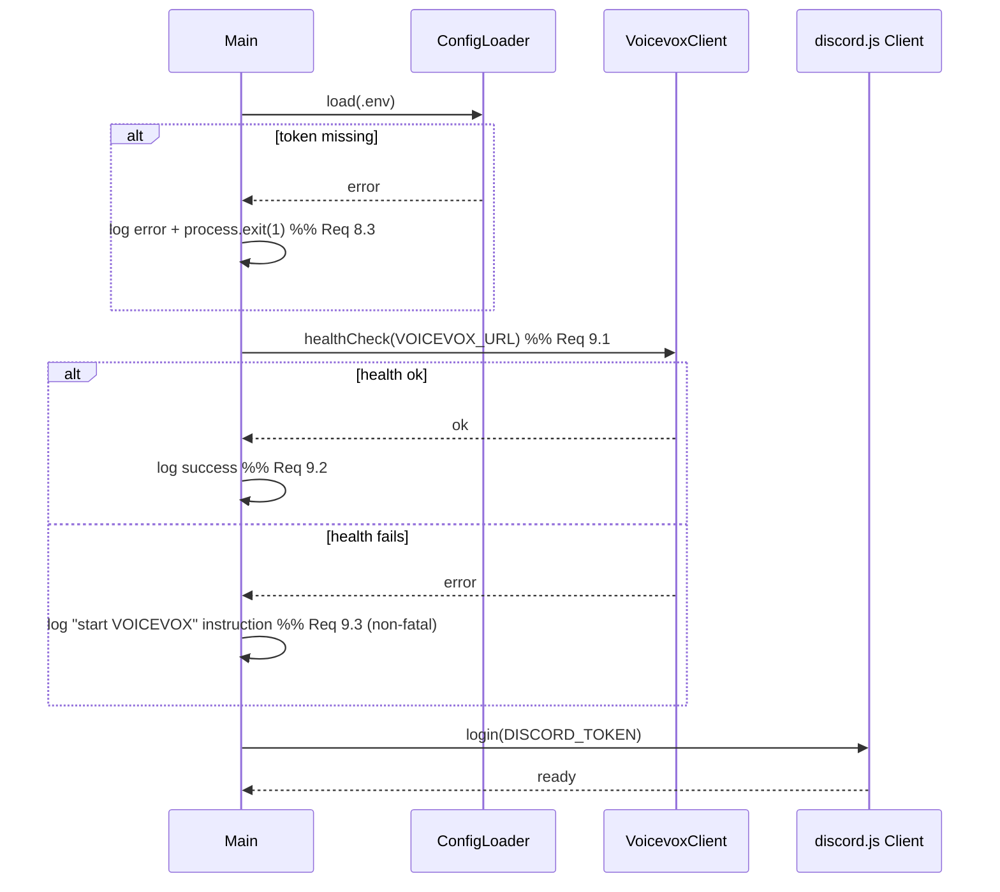
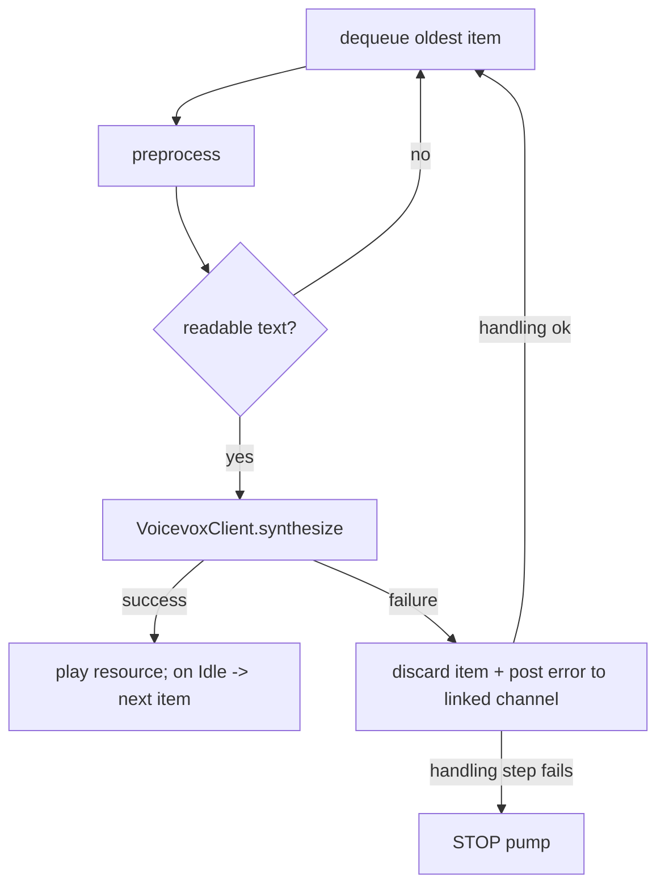

# Design Document

## Overview

This document describes the technical design for the Discord text-to-speech (read-aloud) bot defined in `requirements.md`. The bot connects to a Discord voice channel and reads aloud, in a free cute-sounding Japanese voice, the messages posted in a linked text channel. Speech is synthesized by a locally running [VOICEVOX Engine](https://voicevox.hiroshiba.jp/), which exposes an HTTP API and ships selectable character voices (Zundamon, Shikoku Metan, etc.) at no monetary cost.

### Technology Choices and Rationale

| Concern | Choice | Rationale |
| --- | --- | --- |
| Runtime | **Node.js (LTS, >= 18)** | Native `fetch`, native test runner, broad Windows support, matches the `start.bat` operator workflow (Req 11). |
| Discord gateway/client | **discord.js v14** | Mature, well-documented, first-class voice-state and message events; pairs directly with `@discordjs/voice`. |
| Voice transport & playback | **@discordjs/voice** | Official voice library: `joinVoiceChannel`, `createAudioPlayer`, `createAudioResource`, and connection/player lifecycle events used for FIFO playback (Req 3, 4). See the [Audio Player guide](https://www.discordjs.guide/voice/audio-player). |
| Audio decoding | **prism-media + ffmpeg-static + libsodium-wrappers/@discordjs/opus** | Required transitive dependencies for encrypting/encoding a VOICEVOX WAV stream for Discord. |
| TTS engine | **VOICEVOX Engine** (`http://127.0.0.1:50021`) | Free, local, cute Japanese voices; simple two-step HTTP synthesis (`/audio_query` then `/synthesis`). Content was rephrased for compliance with licensing restrictions. |
| HTTP client | **Native `fetch`** (Node 18+) | No extra dependency for VOICEVOX calls and health checks. |
| Config | **dotenv + `.env`** | Operator edits a plain file, no source changes (Req 8). |
| Testing | **Vitest** (+ `fast-check` for property tests) | Fast, TypeScript/ESM-friendly, single-run mode for CI; `fast-check` supports the property-based tests for preprocessing (Req 7, 12). |

### Research Notes

- **VOICEVOX synthesis is a two-call flow.** A client first POSTs to `/audio_query?text=...&speaker=<id>` to obtain a JSON query object, then POSTs that JSON to `/synthesis?speaker=<id>` to receive WAV audio bytes. The default engine endpoint is `http://127.0.0.1:50021`. A `GET /speakers` call returns the catalog of characters and their styles (each style has a numeric `id` = Speaker_ID). `GET /version` is a lightweight startup health-check target. Content was rephrased for compliance with licensing restrictions. (Sources: [VOICEVOX engine repo/API](https://github.com/VOICEVOX/voicevox_engine), community examples such as [a synthesis sample gist](https://gist.github.com/nishi-yuki/0bdc1b04668c2fd96316280339c9cbc0).)
- **@discordjs/voice playback lifecycle.** `createAudioResource(stream)` wraps the VOICEVOX WAV stream; `player.play(resource)` starts playback; the player emits `AudioPlayerStatus.Idle` when a resource finishes. Driving the FIFO queue off the `Idle` transition gives ordered, gapless playback and a natural place to start the next item (Req 4.3). Calling `player.stop()` forces the current resource to end (used by skip, Req 4.4 / 10.4). (Source: [discord.js voice AudioPlayer docs](https://discord.js.org/docs/packages/voice/main/AudioPlayer:Class).)

### Requirements Traceability Summary

All 12 requirements are addressed by the components below:

| Requirement | Primary Component(s) |
| --- | --- |
| 1 Join voice channel | `CommandHandler.join`, `SessionManager`, `VoiceService` |
| 2 Leave voice channel | `CommandHandler.leave`, `SessionManager`, voice-state listener |
| 3 Read messages aloud | `MessageListener`, `MessageFilter`, `PlaybackQueue`, `VoicevoxClient` |
| 4 Ordered playback | `PlaybackQueue`, `AudioPlaybackController` |
| 5 Voice selection | `CommandHandler.voice/voices`, `VoicevoxClient`, `Session` |
| 6 Preprocessing | `preprocess()` pure module |
| 7 Preprocessing round-trip/idempotence | `preprocess()` pure module + property tests |
| 8 Configuration | `ConfigLoader` |
| 9 VOICEVOX availability | `VoicevoxClient.healthCheck`, `AudioPlaybackController` error path |
| 10 Commands | `CommandRouter` + `CommandHandler` |
| 11 Windows launcher | `start.bat` |
| 12 Verification & testing | Vitest suites + `VERIFICATION.md` |

## Architecture

The bot is a single Node.js process organized into layered modules. The design deliberately separates **pure logic** (text preprocessing, queue ordering) from **I/O-bound services** (Discord gateway, VOICEVOX HTTP, audio transport) so the core behavior is unit- and property-testable without network access.

```mermaid
flowchart TD
    subgraph Discord
        GW[Discord Gateway<br/>discord.js v14 Client]
    end
    subgraph Bot Process
        EL[Event Layer<br/>MessageListener / VoiceStateListener]
        CR[CommandRouter + CommandHandler]
        MF[MessageFilter]
        PRE[preprocess pure module]
        SM[SessionManager<br/>per-guild Session map]
        PQ[PlaybackQueue FIFO]
        APC[AudioPlaybackController<br/>@discordjs/voice AudioPlayer]
        VC[VoicevoxClient HTTP]
        CFG[ConfigLoader .env]
    end
    subgraph External
        VV[VOICEVOX Engine<br/>http://127.0.0.1:50021]
        VOICE[Discord Voice Channel]
    end

    GW -->|messageCreate| EL
    GW -->|voiceStateUpdate| EL
    EL -->|prefixed| CR
    CR --> CH[CommandHandler]
    CH --> SM
    EL -->|plain message| MF
    MF -->|accepted| SM
    SM --> PQ
    PQ --> APC
    APC -->|text| PRE
    PRE -->|spoken text| VC
    VC -->|/audio_query + /synthesis| VV
    VV -->|WAV bytes| VC
    VC -->|WAV stream| APC
    APC -->|Opus| VOICE
    CFG --> SM
    CFG --> VC
    CFG --> CH
```

### Layer Responsibilities

1. **Event Layer** — subscribes to `messageCreate` and `voiceStateUpdate`. Routes prefixed messages to the command path and plain messages to the read-aloud path. Detects when a voice channel is empty of humans (Req 2.5).
2. **Command Layer** — `CommandRouter` parses the Command_Prefix and command name; `CommandHandler` executes join/leave/skip/clear/voice/voices/help and posts responses.
3. **Session Layer** — `SessionManager` holds one `Session` per guild (voice connection, linked text channel, speaker ID, queue, audio controller). Sessions are created on join and destroyed on leave/empty-channel.
4. **Playback Layer** — `PlaybackQueue` (pure FIFO with a max size) plus `AudioPlaybackController` that pulls items, preprocesses, synthesizes, and plays them in order, advancing on the player's `Idle` event.
5. **Service Layer** — `VoicevoxClient` (HTTP: health check, audio query, synthesis, speaker list) and `VoiceService` (thin wrapper over `@discordjs/voice` join/leave).
6. **Config Layer** — `ConfigLoader` reads `.env`, applies defaults, and enforces the token requirement.

### Startup Sequence



## Components and Interfaces

### ConfigLoader

Loads and validates configuration at startup (Req 8).

```ts
interface Config {
  discordToken: string;      // required; absence => exit(1)
  voicevoxUrl: string;       // default "http://127.0.0.1:50021"
  defaultSpeaker: number;    // default 3 (Zundamon Normal)
  commandPrefix: string;     // default "!"
  readingLimit: number;      // default 100 (max spoken characters)
}

function loadConfig(env: NodeJS.ProcessEnv): Config; // throws MissingTokenError if token absent
```

- Missing `DISCORD_TOKEN` -> log identifying error and `process.exit(1)` (Req 8.3).
- Missing `VOICEVOX_URL` -> apply documented default (Req 8.4).
- Any other missing value -> documented default (Req 8.5).

### VoicevoxClient

Wraps all VOICEVOX HTTP interaction (Req 5, 9).

```ts
interface Speaker { name: string; styleId: number; styleName: string; }

interface VoicevoxClient {
  healthCheck(): Promise<boolean>;                 // GET /version  (Req 9.1)
  listSpeakers(): Promise<Speaker[]>;              // GET /speakers (Req 5.5)
  isValidSpeaker(id: number): Promise<boolean>;    // derived from /speakers (Req 5.4)
  synthesize(text: string, speakerId: number): Promise<Readable>; // /audio_query -> /synthesis (Req 3.2)
}
```

- `synthesize` performs `POST /audio_query?text=<text>&speaker=<id>` then `POST /synthesis?speaker=<id>` with the query JSON, returning a WAV byte stream.
- Any non-2xx or network failure rejects, surfacing to the caller's failure handling (Req 9.4).

### MessageFilter

Pure predicate deciding whether a message should be read aloud (Req 3.3-3.5).

```ts
function shouldRead(msg: {
  authorId: string;
  authorIsBot: boolean;
  botUserId: string;
  content: string;
  channelId: string;
}, session: Session, commandPrefix: string): boolean;
```

Excludes: the bot's own messages, other bots, messages beginning with the Command_Prefix, and messages not from the Linked_Text_Channel.

### preprocess (pure module)

Central testable transformation (Req 6, 7). See Data Models for `MentionTable`.

```ts
function preprocess(raw: string, mentions: MentionTable, readingLimit: number): string;
```

Transformation order (fixed and deterministic):
1. Replace fenced code blocks (```` ``` ... ``` ````) with a spoken placeholder (Req 6.4).
2. Replace URLs with a spoken placeholder (Req 6.1).
3. Replace mentions (`<@id>`, `<@!id>`, `<@&id>`, `<#id>`) with resolved display names from `MentionTable` (Req 6.2).
4. Replace custom emojis (`<:name:id>`, `<a:name:id>`) with `name` (Req 6.3).
5. Collapse/normalize whitespace.
6. If length > `readingLimit`, truncate to the limit **including** the omission placeholder so the result never exceeds `readingLimit` (Req 6.5, 7.4).

Special results: returns an empty string when nothing readable remains (caller discards, Req 6.6). Clean, within-limit input returns unchanged (Req 7.2). Applying `preprocess` to its own output yields the same string (Req 7.3).

### CommandRouter and CommandHandler

Parses and dispatches commands (Req 10).

```ts
type CommandName = 'join' | 'leave' | 'skip' | 'clear' | 'voice' | 'voices' | 'help';

interface ParsedCommand { name: CommandName | null; args: string[]; }

function parseCommand(content: string, prefix: string): ParsedCommand | null; // null if no prefix

interface CommandHandler {
  join(ctx: CommandContext): Promise<void>;   // Req 1
  leave(ctx: CommandContext): Promise<void>;  // Req 2
  skip(ctx: CommandContext): Promise<void>;   // Req 4.4, 10.4
  clear(ctx: CommandContext): Promise<void>;  // Req 10.5
  voice(ctx: CommandContext): Promise<void>;  // Req 5.3, 5.4
  voices(ctx: CommandContext): Promise<void>; // Req 5.5
  help(ctx: CommandContext): Promise<void>;   // Req 10.2
}
```

- Prefixed message that names zero or more-than-one recognized command -> unrecognized-command response referencing help (Req 10.3).
- `skip` proceeds to the next item even if stopping the current item throws (Req 10.4 / 4.4).

### SessionManager

Owns per-guild sessions (Req 1, 2, 5).

```ts
interface SessionManager {
  getOrCreate(guildId: string, params: JoinParams): Session; // Req 1.1, 1.5 (move)
  get(guildId: string): Session | undefined;
  end(guildId: string, reason: 'command' | 'empty-channel'): Promise<void>; // Req 2.1, 2.2, 2.5
}
```

Ending a session disconnects the voice connection, clears the queue (Req 2.2), stops the audio player, and posts the appropriate confirmation (Req 2.3 / 2.6).

### PlaybackQueue

Pure, in-memory FIFO with a maximum size (Req 3, 4).

```ts
interface PlaybackQueue {
  enqueue(item: QueueItem): boolean; // false if at max size (item dropped)
  dequeue(): QueueItem | undefined;  // oldest first (FIFO)
  clear(): void;                     // Req 10.5
  size(): number;
  peek(): QueueItem | undefined;
}
```

### AudioPlaybackController

Drives synthesis + ordered playback for one session (Req 3, 4, 9).

```ts
interface AudioPlaybackController {
  notify(): void;   // called after enqueue; starts pump if idle
  skip(): void;     // stop current, advance (Req 4.4/4.5, 10.4)
  stopAll(): void;  // stop + used during session end
}
```

Behavior:
- A single "pump" loop dequeues the oldest item, runs `preprocess`, discards if empty (Req 6.6), calls `VoicevoxClient.synthesize`, wraps the stream via `createAudioResource`, and `player.play(resource)`.
- On `AudioPlayerStatus.Idle`, the pump advances to the next item within 1 second (Req 4.3).
- New arrivals during playback are appended, not interrupted (Req 4.2).
- Synthesis failure: discard current item, post an error to the Linked_Text_Channel, then continue with remaining items (Req 9.4, 9.5). If the failure-handling itself fails, halt the pump (Req 9.6).
- `skip` on empty queue stops playback without starting a new item (Req 4.5).

### VoiceStateListener

Watches `voiceStateUpdate`; when the bot's voice channel has no remaining human participants, ends the session and posts confirmation (Req 2.5, 2.6).

## Data Models

### Config

Loaded once at startup (Req 8). Defaults documented in `.env.example`.

| Field | Env Var | Type | Default | Requirement |
| --- | --- | --- | --- | --- |
| discordToken | `DISCORD_TOKEN` | string | (none, required) | 8.2, 8.3 |
| voicevoxUrl | `VOICEVOX_URL` | string | `http://127.0.0.1:50021` | 8.2, 8.4 |
| defaultSpeaker | `DEFAULT_SPEAKER` | number | `3` | 5.2, 8.2, 8.5 |
| commandPrefix | `COMMAND_PREFIX` | string | `!` | 8.2, 8.5, 10.1 |
| readingLimit | `READING_LIMIT` | number | `100` | 6.5, 7.4, 8.2, 8.5 |

### Session

Per-guild runtime state (Req 1, 2, 5).

```ts
interface Session {
  guildId: string;
  voiceChannelId: string;
  linkedTextChannelId: string;   // Req 1.2, updated on move Req 1.5
  speakerId: number;             // starts at Config.defaultSpeaker (Req 5.2), updatable (Req 5.3)
  connection: VoiceConnection;   // @discordjs/voice
  player: AudioPlayer;           // @discordjs/voice
  queue: PlaybackQueue;
  controller: AudioPlaybackController;
}
```

### QueueItem

One pending message awaiting synthesis/playback (Req 3, 4).

```ts
interface QueueItem {
  rawContent: string;       // original message text
  mentions: MentionTable;   // resolved at enqueue time from the Discord message
  enqueuedAt: number;       // ordering / diagnostics
}
```

### MentionTable

Resolution map passed into `preprocess` so the pure function needs no Discord objects (Req 6.2, 7.1).

```ts
interface MentionTable {
  users: Record<string, string>;    // userId -> display name
  roles: Record<string, string>;    // roleId -> role name
  channels: Record<string, string>; // channelId -> channel name
}
```

### Spoken Placeholders (constants)

| Placeholder | Used for | Requirement |
| --- | --- | --- |
| `URL` (e.g. "リンク") | URL replacement | 6.1 |
| code-block placeholder (e.g. "コード") | fenced code block | 6.4 |
| omission suffix (e.g. "以下略") | truncation marker | 6.5 |


## Correctness Properties

*A property is a characteristic or behavior that should hold true across all valid executions of a system — essentially, a formal statement about what the system should do. Properties serve as the bridge between human-readable specifications and machine-verifiable correctness guarantees.*

Property-based testing applies to this feature's **pure logic**: the `preprocess` transformation, the `MessageFilter` predicate, the `PlaybackQueue` FIFO, the command parser, and configuration defaulting. I/O-heavy behavior (voice connection, VOICEVOX HTTP, audio timing, `start.bat`) is covered by example/integration/smoke tests and the manual verification procedure instead — see Testing Strategy.

The following properties were derived from the prework analysis and consolidated during property reflection (redundant filter/enqueue/length criteria were merged).

### Property 1: Message filter correctness

*For any* message, `shouldRead` returns true if and only if the message is from the Linked_Text_Channel, its author is not the bot itself, its author is not a bot account, and its content does not begin with the Command_Prefix.

**Validates: Requirements 3.3, 3.4, 3.5**

### Property 2: FIFO queue ordering with capacity

*For any* sequence of items enqueued into a `PlaybackQueue` (accepting items up to the maximum size and dropping the rest), dequeuing repeatedly returns the accepted items in exactly their enqueue order, and the queue size never exceeds the maximum.

**Validates: Requirements 3.1, 4.1, 4.2**

### Property 3: URL replacement removes URLs

*For any* input string containing one or more URLs, the output of `preprocess` contains no URL substring and contains the fixed URL placeholder in each URL's position.

**Validates: Requirements 6.1**

### Property 4: Mention replacement resolves display names

*For any* input string containing user, role, or channel mentions whose IDs are present in the `MentionTable`, the output of `preprocess` contains the corresponding display names and none of the raw mention tokens.

**Validates: Requirements 6.2**

### Property 5: Custom emoji replacement uses emoji name

*For any* input string containing custom Discord emoji tokens (`<:name:id>` or `<a:name:id>`), the output of `preprocess` contains each emoji's `name` and none of the raw emoji tokens.

**Validates: Requirements 6.3**

### Property 6: Code-block replacement removes fenced content

*For any* input string containing a fenced code block, the output of `preprocess` contains the fixed code placeholder and does not contain the fenced code content.

**Validates: Requirements 6.4**

### Property 7: Output length is bounded

*For any* input string, the length of the output of `preprocess` does not exceed the reading limit defined in Config, and any input whose spoken form is truncated ends with the fixed omission placeholder.

**Validates: Requirements 6.5, 7.4**

### Property 8: Clean, within-limit input is unchanged

*For any* input string that contains no URLs, mentions, custom emojis, or code blocks and whose length is within the reading limit, `preprocess` returns that string unchanged.

**Validates: Requirements 7.2**

### Property 9: Preprocessing is idempotent

*For any* input string, applying `preprocess` to the output of `preprocess` yields a result equal to that output (`preprocess(preprocess(x)) == preprocess(x)`).

**Validates: Requirements 7.3**

### Property 10: Invalid speaker selection retains previous voice

*For any* speaker ID that VOICEVOX_Engine does not provide, and regardless of whether the notification message is posted successfully, the session's Speaker_ID remains equal to its value before the voice-selection command.

**Validates: Requirements 5.4**

### Property 11: Configuration defaults are applied

*For any* subset of optional configuration variables that are omitted (with the Discord token present), `loadConfig` returns the documented default value for each omitted variable and the provided value for each present variable.

**Validates: Requirements 8.4, 8.5**

### Property 12: Commands require the prefix

*For any* message content that does not begin with the Command_Prefix, `parseCommand` returns null (the message is never treated as a command).

**Validates: Requirements 10.1**

## Error Handling

The design treats errors at three boundaries: startup, per-command, and per-playback-item. The guiding principle is **fail loud at startup, degrade gracefully at runtime**.

### Startup Errors

| Condition | Handling | Requirement |
| --- | --- | --- |
| Missing `DISCORD_TOKEN` | Log an error naming the missing token; `process.exit(1)` | 8.3 |
| Missing `VOICEVOX_URL` | Apply default `http://127.0.0.1:50021`; continue | 8.4 |
| Other missing config | Apply documented default; continue | 8.5 |
| VOICEVOX health-check success | Log success message | 9.2 |
| VOICEVOX health-check failure | Log an instruction to start VOICEVOX_Engine; **do not exit** (engine may start later) | 9.3 |

### Command Errors

| Condition | Handling | Requirement |
| --- | --- | --- |
| Join while user not in a voice channel | Post instruction to join a voice channel first | 1.4 |
| Leave with no active session | Post "no active session" message | 2.4 |
| Unrecognized / ambiguous command | Post unrecognized-command message referencing `help` | 10.3 |
| Voice selection with invalid Speaker_ID | Retain previous Speaker_ID; post available IDs; Speaker_ID stays retained even if the post fails | 5.4 |
| Failure posting a confirmation/response | Log and swallow; never crash the process or mutate session state on a failed post | 5.4 |

### Playback / Synthesis Errors

The `AudioPlaybackController` pump wraps each item in a try/catch:



- Synthesis failure -> discard the current item and post an error message to the Linked_Text_Channel (Req 9.4), then continue with the remaining queue (Req 9.5).
- If any step of that failure handling does not complete (e.g., the error post throws), the pump stops processing the queue to avoid an inconsistent state (Req 9.6).
- `skip` calls `player.stop()` inside a try/catch and advances to the next item even if `stop()` throws (Req 4.4 / 10.4). On an empty queue, `skip` stops playback without starting a new item (Req 4.5).
- When all human participants leave, the `VoiceStateListener` ends the session, clears the queue, and posts confirmation (Req 2.5, 2.6).

## Testing Strategy

A dual approach is used: **property-based tests** validate the universal properties of the pure logic, while **example/unit tests**, **integration tests**, and a **manual verification procedure** cover concrete branches, I/O wiring, and end-to-end behavior.

### Tooling

- **Test runner:** Vitest, executed in single-run mode (`vitest run`) so it is CI-friendly and reports a pass/fail result per test (Req 12.4). (The operator runs it manually; no watch mode is used.)
- **Property-based testing:** `fast-check`, integrated with Vitest. Property-based testing is **not** implemented from scratch.
- **Configuration:** Each property test runs a minimum of **100 iterations**.
- **Tagging:** Each property test is tagged with a comment in the format `Feature: discord-tts-bot, Property {number}: {property_text}` referencing the design property it implements.

### Property-Based Tests (pure logic)

Each correctness property above maps to exactly one property-based test:

| Property | Target module | Generators |
| --- | --- | --- |
| 1 Filter correctness | `MessageFilter.shouldRead` | random authorId/botUserId, isBot flag, channelId, prefix, content |
| 2 FIFO ordering + capacity | `PlaybackQueue` | random arrays of items, random max size |
| 3 URL replacement | `preprocess` | text with injected random URLs |
| 4 Mention replacement | `preprocess` | text with random mention tokens + matching MentionTable |
| 5 Emoji replacement | `preprocess` | text with random custom-emoji tokens |
| 6 Code-block replacement | `preprocess` | text with random fenced code blocks |
| 7 Length bound | `preprocess` | arbitrary unicode strings incl. very long inputs |
| 8 Identity on clean input | `preprocess` | generated "clean" strings within the limit |
| 9 Idempotence | `preprocess` | arbitrary unicode strings (incl. URLs/mentions/emoji/code) |
| 10 Invalid speaker retention | voice-selection handler | random invalid IDs; send stub set to succeed or throw |
| 11 Config defaults | `loadConfig` | random subsets of optional env vars omitted |
| 12 Prefix-only parsing | `parseCommand` | arbitrary content not starting with the prefix |

Generators for Property 7/9 deliberately include edge cases from the prework: empty strings, whitespace-only strings (Req 6.6), non-ASCII/emoji, and inputs at and beyond the reading limit.

### Unit / Example Tests

Concrete-branch behavior not suited to PBT (from the prework classifications):

- Join: sets linked channel (1.2), posts confirmation (1.3), not-in-voice instruction (1.4), move-on-rejoin (1.5).
- Leave: disconnect/end (2.1), clears queue (2.2), confirmation (2.3), no-session message (2.4), empty-channel detection + confirmation (2.5, 2.6).
- Speaker: default at start (5.2), valid update (5.3), voices listing content (5.5).
- Discard on empty preprocessing result (6.6); skip on empty queue (4.5); skip advances even if stop throws (4.4/10.4); clear empties queue (10.5).
- Config: loads env (8.1), reads all five values (8.2), missing-token exit (8.3), missing-URL default (8.4).
- Playback controller: appends without interrupting current playback (4.2), Idle advances to next item (4.3), synthesis failure discards + posts + continues (9.4, 9.5), halt when handling step fails (9.6).
- Commands: help lists commands (10.2), unrecognized command references help (10.3).
- VOICEVOX health check invoked with success/failure messages (9.1, 9.2, 9.3) using a mocked `fetch`.

### Integration Tests (mocked boundaries)

- `VoicevoxClient.synthesize` against a mock HTTP server: verifies the `/audio_query` -> `/synthesis` sequence and that a WAV stream is returned (representative of Req 3.2).
- Session join/leave against a mocked `@discordjs/voice` layer (Req 1.1, 2.1).

### Manual Verification Procedure (Req 12.3)

Documented in `VERIFICATION.md` at the project root:
1. Start VOICEVOX_Engine and confirm `http://127.0.0.1:50021/version` responds.
2. Create/populate `.env` (at minimum `DISCORD_TOKEN`).
3. Launch the bot (double-click `start.bat` on Windows, or `npm start`).
4. Confirm the console logs the VOICEVOX connection-success message.
5. Join a Discord voice channel and issue the `join` command; confirm the bot joins and posts a confirmation.
6. Post a plain text message in the linked channel; confirm audio playback in the voice channel.
7. Post messages containing a URL, a mention, a custom emoji, a code block, and a very long text; confirm sensible spoken output.
8. Post multiple messages quickly; confirm FIFO ordering and test `skip` / `clear`.
9. Issue `leave`; confirm disconnect and confirmation message.

### Requirement 11 (Windows launcher) and Requirement 12 meta-criteria

`start.bat` behavior (Req 11.1-11.4) and the presence of test suites / verification doc (Req 12.1-12.3) are validated by the manual procedure and repository inspection (smoke-level), as they are not amenable to automated property or unit testing within the Node process.
