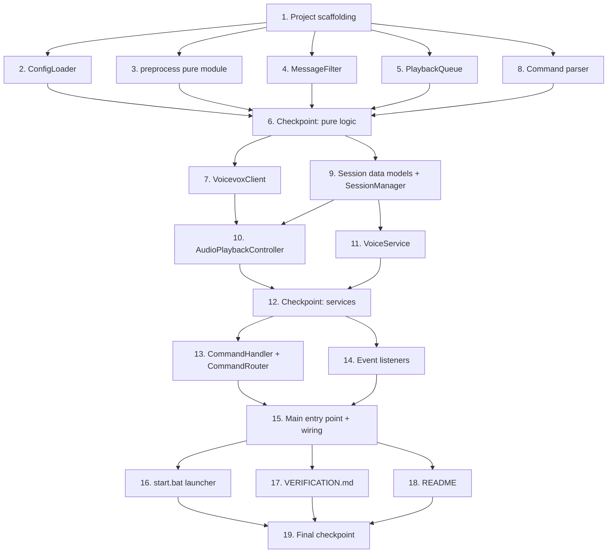

# Implementation Plan: Discord TTS (Read-Aloud) Bot

## Overview

This plan converts the design into incremental coding steps. The bot is a single Node.js (ESM, >= 18) process using discord.js v14, @discordjs/voice, and a locally hosted VOICEVOX Engine for synthesis. Implementation is in JavaScript (ESM) with JSDoc type annotations — the design's TypeScript interfaces are used as contracts, and the selected dependency set includes no TypeScript build tooling.

The build order deliberately starts with the **pure, testable logic** (config defaulting, preprocessing, message filtering, FIFO queue, command parsing) so the correctness properties can be validated in isolation before any Discord/VOICEVOX I/O is wired in. The I/O services, session/playback orchestration, event listeners, and the main entry point are layered on top, and the final tasks wire everything together and deliver the operator-facing `start.bat`, `VERIFICATION.md`, and `README.md`.

The ultimate goal is a **working, verifiable bot**: property/unit/integration tests validate the logic, and the manual verification procedure confirms real end-to-end audio playback.

- Tasks marked with `*` are optional (tests) and can be skipped for a faster MVP, but are strongly recommended.
- Each property-based test runs a **minimum of 100 iterations** with `fast-check` and is tagged `Feature: discord-tts-bot, Property {number}: {property_text}`.
- Property tests are placed next to the module they validate so errors surface early.

## Task Dependency Graph

## Tasks

- [x] 1. Set up project structure, package manifest, and configuration templates
  - Create the directory layout: `src/` (with `config/`, `text/`, `discord/`, `voicevox/`, `playback/`, `session/`, `commands/`, `events/`), `test/`, and project root files.
  - Create `package.json` with `"type": "module"`, a `start` script (`node src/index.js`) and a `test` script (`vitest run`); add runtime dependencies (`discord.js`, `@discordjs/voice`, `prism-media`, `ffmpeg-static`, `@discordjs/opus` with `opusscript` as fallback, `libsodium-wrappers`, `dotenv`) and dev dependencies (`vitest`, `fast-check`).
  - Create `.env.example` documenting all five config keys with defaults (`DISCORD_TOKEN`, `VOICEVOX_URL=http://127.0.0.1:50021`, `DEFAULT_SPEAKER=3`, `COMMAND_PREFIX=!`, `READING_LIMIT=100`).
  - Create `.gitignore` (`node_modules/`, `.env`).
  - _Requirements: 8.1, 8.2, 11.4, 12.4_

- [x] 2. Implement the configuration loader
  - [x] 2.1 Implement `loadConfig(env)` in `src/config/configLoader.js`
    - Read the five config values from the environment; apply documented defaults for every value except the token; throw a `MissingTokenError` when `DISCORD_TOKEN` is absent; coerce numeric values (`DEFAULT_SPEAKER`, `READING_LIMIT`).
    - _Requirements: 8.1, 8.2, 8.4, 8.5_

  - [x]* 2.2 Write property test for configuration defaulting
    - **Property 11: Configuration defaults are applied**
    - **Validates: Requirements 8.4, 8.5**

  - [x]* 2.3 Write unit tests for token and URL handling
    - Test that a missing token throws `MissingTokenError` (drives the `process.exit(1)` path wired in task 15) and that a missing `VOICEVOX_URL` yields the default endpoint.
    - _Requirements: 8.3, 8.4_

- [x] 3. Implement the pure text preprocessing module
  - [x] 3.1 Define spoken-placeholder constants and the `preprocess` skeleton
    - In `src/text/placeholders.js` define URL, code-block, and omission placeholder constants; create `src/text/preprocess.js` exporting `preprocess(raw, mentions, readingLimit)`.
    - _Requirements: 6.1, 6.4, 6.5_

  - [x] 3.2 Implement the deterministic transformation pipeline
    - Apply, in fixed order: fenced code-block replacement, URL replacement, mention resolution via `MentionTable`, custom-emoji name replacement, whitespace normalization, and truncation that keeps the result within `readingLimit` including the omission suffix; return an empty string when nothing readable remains.
    - _Requirements: 6.1, 6.2, 6.3, 6.4, 6.5, 6.6, 7.1, 7.2, 7.3, 7.4_

  - [x]* 3.3 Write property test for URL replacement
    - **Property 3: URL replacement removes URLs**
    - **Validates: Requirements 6.1**

  - [x]* 3.4 Write property test for mention resolution
    - **Property 4: Mention replacement resolves display names**
    - **Validates: Requirements 6.2**

  - [x]* 3.5 Write property test for custom-emoji replacement
    - **Property 5: Custom emoji replacement uses emoji name**
    - **Validates: Requirements 6.3**

  - [x]* 3.6 Write property test for code-block replacement
    - **Property 6: Code-block replacement removes fenced content**
    - **Validates: Requirements 6.4**

  - [x]* 3.7 Write property test for output length bound
    - **Property 7: Output length is bounded**
    - Generators must include empty, whitespace-only, non-ASCII, and over-limit inputs.
    - **Validates: Requirements 6.5, 7.4**

  - [x]* 3.8 Write property test for identity on clean input
    - **Property 8: Clean, within-limit input is unchanged**
    - **Validates: Requirements 7.2**

  - [x]* 3.9 Write property test for idempotence
    - **Property 9: Preprocessing is idempotent** (`preprocess(preprocess(x)) == preprocess(x)`)
    - **Validates: Requirements 7.3**

  - [x]* 3.10 Write unit test for the empty-result discard case
    - Confirm inputs that reduce to nothing readable return an empty string so the caller discards them.
    - _Requirements: 6.6_

- [x] 4. Implement the message filter predicate
  - [x] 4.1 Implement `shouldRead(msg, session, commandPrefix)` in `src/discord/messageFilter.js`
    - Return true only when the message is from the Linked_Text_Channel, the author is neither the bot itself nor another bot account, and the content does not begin with the Command_Prefix.
    - _Requirements: 3.3, 3.4, 3.5_

  - [x]* 4.2 Write property test for filter correctness
    - **Property 1: Message filter correctness**
    - **Validates: Requirements 3.3, 3.4, 3.5**

- [x] 5. Implement the playback queue
  - [x] 5.1 Implement `PlaybackQueue` in `src/playback/playbackQueue.js`
    - Provide `enqueue` (returns false and drops when at max size), `dequeue` (FIFO oldest-first), `clear`, `size`, and `peek`.
    - _Requirements: 3.1, 4.1, 4.2, 10.5_

  - [x]* 5.2 Write property test for FIFO ordering with capacity
    - **Property 2: FIFO queue ordering with capacity**
    - **Validates: Requirements 3.1, 4.1, 4.2**

  - [x]* 5.3 Write unit test for clear behavior
    - Confirm `clear` empties the queue and `size` returns 0.
    - _Requirements: 10.5_

- [x] 6. Checkpoint - pure logic complete
  - Ensure all tests pass, ask the user if questions arise.

- [x] 7. Implement the VOICEVOX HTTP client
  - [x] 7.1 Implement health check and speaker discovery in `src/voicevox/voicevoxClient.js`
    - Implement `healthCheck()` (`GET /version`), `listSpeakers()` (`GET /speakers`, flattened to `{name, styleId, styleName}`), and `isValidSpeaker(id)` derived from the speaker list, using native `fetch`.
    - _Requirements: 5.1, 5.4, 5.5, 9.1_

  - [x] 7.2 Implement the two-step synthesis flow
    - Implement `synthesize(text, speakerId)` performing `POST /audio_query?text=&speaker=` then `POST /synthesis?speaker=` with the query JSON, returning a WAV byte stream; reject on non-2xx or network failure.
    - _Requirements: 3.2, 9.4_

  - [x]* 7.3 Write unit tests for health check messaging (mocked fetch)
    - Verify success and failure produce the correct outcomes feeding the startup messages (success confirmation vs. "start VOICEVOX" instruction).
    - _Requirements: 9.1, 9.2, 9.3_

  - [x]* 7.4 Write integration test for the synthesis sequence (mocked HTTP)
    - Assert `synthesize` calls `/audio_query` then `/synthesis` in order and returns a WAV stream.
    - _Requirements: 3.2_

- [x] 8. Implement the command parser
  - [x] 8.1 Implement `parseCommand(content, prefix)` in `src/commands/commandRouter.js`
    - Return null when the content does not begin with the prefix; otherwise parse the command name and args; a prefixed message naming zero or more-than-one recognized command resolves to a null command name (unrecognized), handled downstream in task 13.
    - _Requirements: 10.1, 10.3_

  - [x]* 8.2 Write property test for prefix-gated parsing
    - **Property 12: Commands require the prefix**
    - **Validates: Requirements 10.1**

- [x] 9. Implement session data models and the session manager
  - [x] 9.1 Define `Session`, `QueueItem`, and `MentionTable` shapes and a `buildMentionTable` helper
    - In `src/session/models.js`, document the runtime shapes with JSDoc and implement a helper that resolves a Discord message's user/role/channel mentions into a `MentionTable` at enqueue time.
    - _Requirements: 6.2, 7.1_

  - [x] 9.2 Implement `SessionManager` in `src/session/sessionManager.js`
    - Implement `getOrCreate(guildId, params)` (create on join, move + relink on rejoin), `get(guildId)`, and `end(guildId, reason)` which disconnects the voice connection, clears the queue, stops the player, and posts the reason-appropriate confirmation.
    - _Requirements: 1.1, 1.2, 1.5, 2.1, 2.2, 2.3, 5.2_

  - [x]* 9.3 Write unit tests for session lifecycle
    - Verify create-on-join sets the linked channel and default speaker, rejoin moves and relinks, and `end` clears the queue and posts confirmation for both `command` and `empty-channel` reasons.
    - _Requirements: 1.2, 1.5, 2.2, 2.3, 5.2_

- [x] 10. Implement the audio playback controller
  - [x] 10.1 Implement the pump loop in `src/playback/audioPlaybackController.js`
    - Implement `notify()` to start the pump when idle: dequeue the oldest item, run `preprocess`, discard when empty, call `VoicevoxClient.synthesize`, wrap the stream with `createAudioResource`, and `player.play`; advance to the next item on `AudioPlayerStatus.Idle`; append new arrivals without interrupting current playback.
    - _Requirements: 3.2, 4.1, 4.2, 4.3, 6.6_

  - [x] 10.2 Implement skip, stopAll, and synthesis-failure handling
    - Implement `skip()` (stop current and advance, advancing even if `player.stop()` throws; stop without starting a new item on an empty queue) and `stopAll()`; on synthesis failure discard the item, post an error to the linked channel, and continue with the remaining queue; halt the pump if any failure-handling step does not complete.
    - _Requirements: 4.4, 4.5, 9.4, 9.5, 9.6, 10.4_

  - [x]* 10.3 Write unit tests for controller branches
    - Cover: append-without-interrupt (4.2), Idle advances to the next item (4.3), skip advances even when stop throws (4.4/10.4), skip on empty queue stops without starting (4.5), synthesis failure discards + posts + continues (9.4/9.5), and halt when failure handling fails (9.6).
    - _Requirements: 4.2, 4.3, 4.4, 4.5, 9.4, 9.5, 9.6, 10.4_

- [x] 11. Implement the voice service wrapper
  - [x] 11.1 Implement `VoiceService` in `src/discord/voiceService.js`
    - Wrap `@discordjs/voice` `joinVoiceChannel` and connection destroy for join/leave, returning the connection and player used by the session.
    - _Requirements: 1.1, 2.1_

  - [x]* 11.2 Write integration test for join/leave (mocked @discordjs/voice)
    - Verify join creates a connection/player and leave destroys the connection.
    - _Requirements: 1.1, 2.1_

- [x] 12. Checkpoint - services and orchestration complete
  - Ensure all tests pass, ask the user if questions arise.

- [x] 13. Implement the command handler and dispatch
  - [x] 13.1 Implement join, leave, skip, and clear handlers in `src/commands/commandHandler.js`
    - `join`: connect to the requester's voice channel, start/move the session, set the linked channel, post confirmation, and instruct the user when they are not in a voice channel. `leave`: end the session with confirmation, or post "no active session". `skip`/`clear`: delegate to the controller/queue.
    - _Requirements: 1.1, 1.2, 1.3, 1.4, 1.5, 2.1, 2.3, 2.4, 4.4, 4.5, 10.4, 10.5_

  - [x] 13.2 Implement voice, voices, and help handlers
    - `voice`: validate the requested Speaker_ID via `isValidSpeaker`; on valid, update the session speaker; on invalid, retain the previous speaker and post the available IDs, keeping the speaker retained even when the post fails. `voices`: post character names and IDs from `listSpeakers`. `help`: post supported commands and descriptions.
    - _Requirements: 5.3, 5.4, 5.5, 10.2_

  - [x] 13.3 Wire the router to the handler with unrecognized-command handling
    - Dispatch parsed commands to the matching handler; a prefixed message with no exactly-one recognized command posts an unrecognized-command message referencing `help`.
    - _Requirements: 10.1, 10.3_

  - [x]* 13.4 Write property test for invalid speaker retention
    - **Property 10: Invalid speaker selection retains previous voice**
    - Use a send stub configured to both succeed and throw.
    - **Validates: Requirements 5.4**

  - [x]* 13.5 Write unit tests for command branches
    - Cover not-in-voice instruction (1.4), join confirmation (1.3), no-session leave message (2.4), valid speaker update (5.3), voices listing content (5.5), help listing (10.2), and unrecognized-command referencing help (10.3).
    - _Requirements: 1.3, 1.4, 2.4, 5.3, 5.5, 10.2, 10.3_

- [x] 14. Implement the Discord event listeners
  - [x] 14.1 Implement the `messageCreate` listener in `src/events/messageListener.js`
    - Route prefixed messages through `parseCommand` to the command handler; route plain messages through `shouldRead`, and on acceptance build the `MentionTable`, enqueue a `QueueItem`, and notify the controller.
    - _Requirements: 3.1, 10.1_

  - [x] 14.2 Implement the `voiceStateUpdate` listener in `src/events/voiceStateListener.js`
    - When the bot's voice channel has no remaining human participants, end the session and post the session-end confirmation.
    - _Requirements: 2.5, 2.6_

  - [x]* 14.3 Write unit tests for the listeners
    - Verify plain messages are enqueued only when `shouldRead` passes, and the empty-channel condition triggers session end with confirmation.
    - _Requirements: 2.5, 2.6, 3.1_

- [x] 15. Implement the main entry point and wire everything together
  - [x] 15.1 Implement the startup sequence in `src/index.js`
    - Load config (log the identifying error and `process.exit(1)` on missing token), run the VOICEVOX health check (log success or the "start VOICEVOX" instruction without exiting), construct the client/session-manager/handlers, register the event listeners on a discord.js v14 `Client` with the required intents, and log in.
    - _Requirements: 8.3, 9.1, 9.2, 9.3_

  - [x]* 15.2 Write an integration test for the startup wiring (mocked boundaries)
    - Verify missing-token exit, health-check success/failure logging, and listener registration using mocked discord.js and VoicevoxClient.
    - _Requirements: 8.3, 9.1, 9.2, 9.3_

- [x] 16. Create the Windows launcher script
  - Create `start.bat` at the project root that: launches the bot from the application directory; installs dependencies (`npm install`) when `node_modules` is absent before launching; on a missing Node runtime displays an error, pauses, and still attempts to launch so the OS reports its own error; and keeps the console open displaying the exit status when the process exits non-zero.
  - _Requirements: 11.1, 11.2, 11.3, 11.4_

- [x] 17. Write the manual verification procedure
  - Create `VERIFICATION.md` at the project root documenting the end-to-end steps: start VOICEVOX Engine and confirm `/version`, populate `.env`, launch via `start.bat`/`npm start`, confirm the VOICEVOX success log, join a voice channel and issue `join`, post plain and special-content messages (URL, mention, custom emoji, code block, long text) and confirm sensible playback, test FIFO ordering with `skip`/`clear`, and issue `leave`.
  - _Requirements: 12.3_

- [x] 18. Write the README
  - Create `README.md` covering prerequisites (Node.js >= 18, VOICEVOX Engine), installation, `.env` configuration, running on Windows (`start.bat`) and other platforms (`npm start`), the command reference, and how to run the test suite (`npm test`).
  - _Requirements: 8.1, 12.4_

- [x] 19. Final checkpoint - full suite green and bot runnable
  - Ensure all tests pass (`npm test` reports pass/fail per test), and confirm the entry point starts without runtime errors given a valid `.env`. Ask the user if questions arise.
  - NOTE: The sandbox network mode blocks the npm registry (403), so `npm install` and therefore `vitest`/`npm test` could not be executed here. As a substitute, every source and test file was validated with `node --check`, and each module's logic (session lifecycle, playback controller branches incl. Property 10, voice service, command handler, event listeners, and startup wiring) was exercised with standalone Node harnesses that mirror the Vitest assertions — all passing. Once registry access is available, run `npm install && npm test` once to execute the full Vitest + fast-check suite.

## Notes

- Tasks marked with `*` are optional test sub-tasks and can be skipped for a faster MVP; all core implementation tasks are required.
- Each task references the specific requirement sub-clauses it satisfies for traceability.
- Property-based tests (Properties 1–12) are woven into the implementation tasks nearest the code they validate; each runs a minimum of 100 iterations with `fast-check` and carries the `Feature: discord-tts-bot, Property {number}: {property_text}` tag.
- `start.bat` (Req 11) and the verification/testing meta-criteria (Req 12.1–12.3) are validated by repository inspection and the manual procedure, as they are not amenable to automated property/unit testing within the Node process.
- Checkpoints (tasks 6, 12, 19) provide incremental validation before moving to the next layer.
